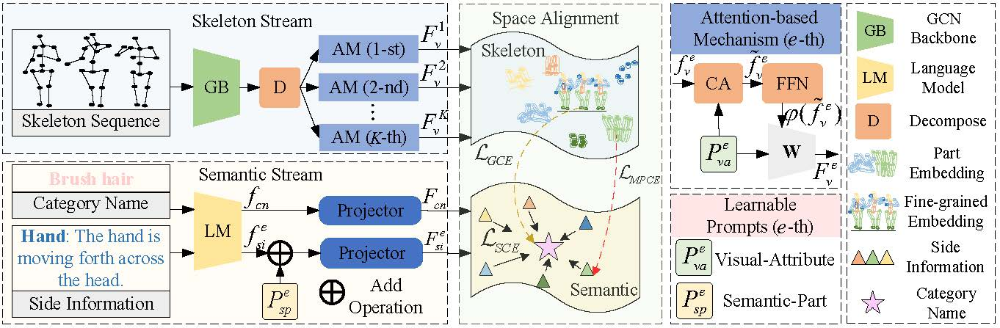

# STAR
This repo is the official implementation for [Fine-Grained Side Information Guided Dual-Prompts for Zero-Shot Skeleton Action Recognition](https://dl.acm.org/doi/10.1145/3664647.3681196). The paper is accepted to ACM MM 2024.

**Note**: We conduct extensive experiments on three datasets in the **ZSL** and **GZSL** settings. 

## Framework


# Prerequisites

- Python >= 3.6
- PyTorch >= 1.1.0

# Data Preparation

Download the raw data of [NTU RGB+D 60](https://rose1.ntu.edu.sg/dataset/actionRecognition), [NTU RGB+D 120](https://rose1.ntu.edu.sg/dataset/actionRecognition), and [PKU MMD II](https://www.icst.pku.edu.cn/struct/Projects/PKUMMD.html) datasets.

For NTU series datasets, we take the same data processing procedure as the [CTR-GCN](https://github.com/Uason-Chen/CTR-GCN). For PKU MMD II dataset, we take the same data processing procedure as the [AimCLR](https://github.com/Levigty/AimCLR).


# Baseline Settings
We conduct the experiment based on the official experimental settings (cross-subject, cross-view, and cross-set) of the NTU RGB+D 60, NTU RGB+D 120, and PKU-MMD I datasets. To make a fair comparison, we update the performance results of the previous studies (e.g., [SynSE](https://github.com/skelemoa/synse-zsl), [SMIE](https://github.com/YujieOuO/SMIE)) under the current experimental settings based on their public codes.

As for known and unknown categories partition strategies that the official requirements lacked, for convenience, we follow the [SynSE](https://github.com/skelemoa/synse-zsl). For NTU 60, we utilize the 55/5 and 48/12 split strategies, which include 5 and 12 unknown categories. For NTU 120, we employ the 110/10 and 96/24 split strategies. For PKU-MMD I, we take the 46/5 and 39/12 split strategies. 

For the optimized experimental settings in Table 5, we follow the known-unknown categories partition strategies of [SMIE](https://github.com/YujieOuO/SMIE).

# Shift-GCN Pretraining Weights
You can download Shift-GCN pretraining weights from [BaiduDisk](https://pan.baidu.com/s/1fz7OAc1MS0ZNdBQADndozg?pwd=r5gd) or [Google Drive](https://drive.google.com/file/d/1O4HrjU0NkBFNCNhPNoPN4xyNDYps5R0D/view?usp=sharing) for convenience. Following the [Shift-GCN](https://github.com/kchengiva/Shift-GCN) procedures, you can train the skeleton encoder yourself.

## Acknowledgements

This repo is based on [CTR-GCN](https://github.com/Uason-Chen/CTR-GCN) and [GAP](https://github.com/MartinXM/GAP). The data processing is borrowed from [CTR-GCN](https://github.com/Uason-Chen/CTR-GCN) and [AimCLR](https://github.com/Levigty/AimCLR). The baseline methods are from [SynSE](https://github.com/skelemoa/synse-zsl) and [SMIE](https://github.com/YujieOuO/SMIE).

Thanks to the original authors for their work!

# Citation

Please cite this work if you find it useful:.
```
@inproceedings{chen2024star,
  title={Fine-Grained Side Information Guided Dual-Prompts for Zero-Shot Skeleton Action Recognition},
  author={Chen, Yang and Guo, Jingcai and He, Tian and Lu, Xiaocheng and Wang, Ling},
  booktitle={Proceedings of the 32nd ACM International Conference on Multimedia},
  pages = {778–786},
  year={2024}
}
```
